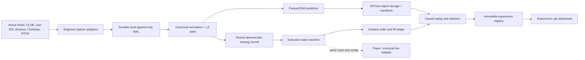

# TV2 Quant Research Platform Audit

> Historical baseline: this records the platform as inspected on 15 July 2026.
> Several capture, WAL, replay and infrastructure findings were implemented
> afterward. Use the dated board review and current runtime checks for present
> status; retain this report to understand why those changes were made.

**Audit date:** 2026-07-15  
**Scope:** TV2 (`deltaforge`) as a strategy-discovery, market-data collection, replay, paper-trading, and experiment-governance platform.  
**Safety:** This audit does not change strategy parameters, paper/live settings, or any live-order path.

## Executive verdict

TV2 is a promising research prototype, not yet a measurement system capable of proving a small or latency-sensitive trading edge. Its strongest component is the BORG research protocol: hypotheses are named, shadow-tested, and intended to pass a minimum sample and time gate. Its weakest component is the causal chain between an exchange event and a simulated fill. Source receive times and sequence identifiers are incomplete, one important Polymarket WebSocket message shape is parsed incorrectly, the socket reconnects frequently, database failures can drop raw observations, and the dashboard's general backtest is a retrospective scenario calculator rather than an event-driven execution backtest.

That is the “hair measured with a ruler” problem. The application can calculate PnL to cents while uncertainty in event arrival, queue position, quote survival, and data gaps is much larger than the claimed edge. More strategies will not solve this. The priority is to build a calibrated instrument: immutable lossless capture, explicit event provenance, deterministic causal replay, a conservative order-state simulator, and locked experiment manifests.

The correct deployment split is not “put the whole application on a VPS.” Put the high-fidelity collectors, online shadow runner, and eventual execution process on the best measured host/region. Keep the dashboard and heavy research compute wherever convenient. Collect at the maximum useful fidelity once, then emulate 100 ms, 500 ms, 1 s, local-Mac, Dublin-VPS, and degraded latency profiles in replay. Slow data cannot later be converted into a valid fast-latency backtest.

No current result is sufficient evidence that a bot is ready for unrestricted live deployment. The existing results are useful for generating hypotheses, rejecting obviously bad mechanisms, and designing forward tests. They should not yet be used as a reliable daily-PnL projection.

## Platform gradecard

| Area | Grade | Finding |
|---|---:|---|
| Research philosophy | B+ | BORG explicitly separates hypotheses, shadow capture, pilot/evaluation phases, costs, and minimum sample windows. |
| Market/outcome coverage | B | Seven assets and thousands of resolved 5-minute markets are represented; live/open capture coverage is substantial. |
| Raw collector reliability | D+ | Frequent CLOB reconnects, aborted polls, stale-feed windows, and dropped DB batches make some intervals unusable. |
| Event provenance and timing | D | Local/source/monotonic timestamps, sequence IDs, connection epochs, and clock uncertainty are not consistently retained. |
| Dashboard backtest fidelity | F | It selects historical rows, assumes fills, reconstructs probability, and uses known outcomes; it is not causal market replay. |
| BORG replay fidelity | C | Better latency and queue models exist, but the input tape is 1-second/incomplete and execution assumptions vary by strategy. |
| Paper execution fidelity | C- | Main paper taker fills walk the current book but are immediate; network delay, quote survival, and non-fill risk are absent. |
| Statistical inference | C | Calibration/autopsy tools exist, but fill-level resampling and correlated observations overstate effective sample size. |
| Reproducibility/governance | C- | Protocol documents are good; immutable dataset/run/config manifests and a central experiment registry are missing. |
| Deployment/operability | D+ | Collection depends on one Mac and a remote hot-path database; the archive is local and has no demonstrated off-host recovery. |
| Overall | **C-** | Capable prototype and hypothesis factory; not yet a trustworthy alpha-measurement instrument. |

## What TV2 currently contains

TV2 is three partially overlapping systems:

1. **The legacy/main bot** in `src/bot/`. It discovers markets, builds signals, applies gates and sizing, simulates or submits orders, manages positions, writes trades, and publishes dashboard state.
2. **BORG recon and shadow research** in `borg/`. It collects multi-venue data, discovers markets and outcomes, produces named shadow orders, scores them, and evaluates hypothesis families.
3. **Dashboard backtesting and research scripts** in `src/routes/backtest.js` and `scripts/`. These provide retrospective scenario calculations, calibration, EV autopsies, portfolio summaries, and newer snapshot replays.

The systems share a database but do not share one canonical event model, one strategy API, or one execution simulator. Consequently, “the same strategy” can have different information, fill assumptions, costs, or timing online, in the dashboard, and in a script.

## Current empirical health snapshot

The following observations were measured during this audit and are point-in-time platform diagnostics, not strategy performance claims:

- The database contains approximately 6,160 discovered markets, 6,141 resolved markets, and 5,148 live-captured opens.
- Coverage exists for BTC, ETH, SOL, XRP, DOGE, BNB, and HYPE, beginning between 2026-07-11 and 2026-07-12 depending on asset.
- The local compressed archive is about 200 MB across roughly 982 files, with approximately 24 hours of high-frequency history at audit time. The database retains a shorter rolling raw window.
- A 24-hour log review found 526 CLOB WebSocket closes/reconnects. Median time between closes was about 96 seconds.
- The same review found 298 aborted taker-trade polls, dozens of feed-silence warnings, dropped snapshot batches following database timeouts, and a maximum observed snapshot gap of about 44 seconds.
- A later live status check still showed current Binance, Coinbase, books, and CLOB events, but repeated CLOB reconnect warnings. The old `chainlink_rounds` source was more than 3,000 seconds stale.
- The archive is local to the Mac. A Mac/disk failure would compromise both collection continuity and the only high-frequency archive unless there is an unobserved external backup.
- The hot PostgreSQL service is in US East. It is inappropriate as a synchronous dependency in a latency-sensitive decision path from Dublin, and its write failure must never cause raw observations to disappear.

These numbers mean that a timestamped row is not automatically a valid observation. Every replay window needs an explicit data-quality verdict.

## Critical findings

### 1. The current CLOB tape is incomplete

`borg/recon/clob.js` processes incremental changes using `ev.changes`. The current Polymarket market-channel schema emits `price_changes`. Therefore, official incremental order/cancel price changes are not being applied as intended. Full `book` messages and periodic snapshots provide some state, but they do not reconstruct a complete event-by-event L2 tape.

The reconnection controls also differ from the current protocol: the implementation reuses initial-style market subscription messages for changes and sends WebSocket control pings, whereas current Polymarket documentation describes dynamic `operation: "subscribe"` / `"unsubscribe"` and text `PING` heartbeats. This is a plausible contributor to frequent reconnects and must be fixed and measured, not assumed.

Authoritative references:

- [Polymarket WebSocket overview](https://docs.polymarket.com/market-data/websocket/overview)
- [Polymarket market channel and `price_changes`](https://docs.polymarket.com/market-data/websocket/market-channel)

**Consequence:** queue simulation, quote-lifetime studies, sub-second adverse selection, and millisecond latency sweeps are provisional on the current tape.

### 2. The collector records too little event provenance

Binance streams include useful source timestamps and trade/update identifiers, but TV2 primarily persists completed one-second bars. Coinbase is similarly sampled to one row per exchange second. Their local receive time, monotonic receive time, sequence/trade IDs, connection epoch, and raw messages are not consistently durable.

This creates a causal ambiguity: a replay can use an exchange-time event before the local collector could have received it. It also makes it difficult to distinguish network delay from exchange publication delay or event-loop delay.

Coinbase's Level 2 channel guarantees delivery of updates and `level2_batch` provides a 50 ms batched option; TV2 currently records ticker/heartbeat rather than a reconstructable Coinbase book. Binance offers real-time aggregate trades/book ticker and 100 ms depth updates. These should be captured as raw events, not reduced to one-second bars before archival.

Authoritative references:

- [Binance Spot WebSocket streams](https://developers.binance.com/zh-CN/docs/products/spot/testnet/web-socket-streams)
- [Coinbase Exchange WebSocket overview](https://docs.cdp.coinbase.com/exchange/websocket-feed/overview)
- [Coinbase WebSocket channels](https://docs.cdp.coinbase.com/exchange/websocket-feed/channels)

### 3. A database timeout can destroy research evidence

The collector batches inserts and flushes to PostgreSQL. Observed timeouts dropped snapshot batches. The warning is also written through the same infrastructure. There is no durable local append-before-ack log covering all incoming frames.

**Required invariant:** once an event reaches the process, it is appended to a local durable write-ahead log before it is acknowledged internally. Database/object-store persistence can lag and retry without data loss. Strategy evaluation pauses if the local spool is unhealthy or over capacity.

### 4. The dashboard “backtest” is not a backtest

`src/routes/backtest.js` combines skipped signals and historical trades, applies retrospective gates, substitutes a simplified Gate 3, reconstructs model probability as entry price plus historical EV, assumes each selected row fills at its recorded entry, attaches the final outcome, and compounds Kelly sizing.

It does not replay the market in event time, reproduce the information available at decision time, simulate an order arriving after delay, check quote survival/depth, or model non-fills. The result is useful only as a **retrospective scenario calculator over previously generated rows**. Presenting its PnL as strategy backtest PnL creates selection, fill, and look-ahead risk.

**Immediate UI action:** relabel it accordingly and add a conspicuous “not execution-replay evidence” banner. Do not show it alongside causal replay without a fidelity grade.

### 5. Main paper fills are too optimistic for latency-sensitive research

The main paper route in `src/bot/BotInstance.js` walks the visible book and adds a price tick, which is better than filling arbitrary size at mid. It then records an immediate fill with `timeToFillSec = 0`. A one-tick penalty is not equivalent to 500 ms of latency: the quote can disappear, move several ticks, partially fill, or never fill.

BORG is more conservative in places: it includes back-of-queue maker scoring, partial fills, costs, and a fixed 1,250 ms taker model. But several taker paths still default to `touch_immediate`, and a constant 1,250 ms conflates data sampling, process scheduling, database transit, network transit, and exchange acknowledgement.

**Consequence:** live predictiveness cannot be estimated until one common execution state machine is used online and offline.

### 6. Maker scoring depends on a damaged trade tape

Back-of-queue execution is a reasonable conservative starting point, but it relies on observed CLOB trades to consume queue ahead. Frequent socket disconnects and ignored incremental changes can turn real fills into simulated non-fills or, depending on fallback state, create false fills. The current scorer's “blind” test is too weak when it only detects no events rather than partial outages.

All intervals spanning a sequence gap, reconnect recovery, stale source, crossed/invalid book, or failed snapshot reconciliation must be quarantined. A strategy gets no score for that window; it does not get a win, loss, or non-fill.

### 7. Source-of-truth mismatch is not fully captured

The markets resolve from Chainlink-based crypto prices while much of the signal originates from Binance. The legacy Chainlink mainnet push feed is stale and is not an adequate live representation of the resolver source. Polymarket's free RTDS exposes Chainlink and Binance crypto streams for BTC, ETH, SOL, and XRP. Capture both, with source and receive timestamps, to measure oracle divergence and lag causally.

Reference: [Polymarket RTDS crypto prices](https://docs.polymarket.com/market-data/websocket/rtds).

For DOGE, BNB, and HYPE, resolution-source provenance needs to be verified per market. A generic proxy should not be silently treated as the resolver.

### 8. Experiment identities are not immutable

Strategy definitions, phase assignments, dashboard descriptions, and thesis versions are distributed across files. Multiple strategies share broad `THESIS_VERSION` constants. Results are not keyed to a complete immutable manifest containing source commit, config hash, dataset hash, latency profile, execution model, fee version, seed, and train/evaluation cutoff.

This permits accidental mid-test changes, result drift when archive contents grow, and post-hoc selection. Some old feature data is nulled after a retention period, which makes later forensic reproduction impossible.

### 9. Effective sample size is overstated

The economically independent unit is usually the 5-minute market/window or day, not each fill. Multiple assets can respond to one BTC move; multiple strategy variants can take the same event; paired legs and partial fills are dependent. Fill-level bootstrap using unseeded `Math.random()` produces unstable confidence intervals and treats correlated rows as independent.

Use seeded block/cluster resampling by UTC day and 5-minute window, preserving all fills/assets/variants within the cluster. Report both raw fills and independent clusters. Correct for every strategy/parameter variation evaluated, not only variants that reached the dashboard.

### 10. Cross-asset event order is not deterministic

Online strategies are evaluated in per-asset loops. Offline snapshots can be sorted by timestamp and then market ID. Strategies that compare assets can therefore observe different cross-asset state depending on loop/order tie-breaking.

Use an event-time watermark and deterministic batch semantics: process all events up to a timestamp, publish a coherent state version, then evaluate cross-asset strategies. Include a defined maximum lateness and quarantine/revision policy.

## Data acquisition blueprint

| Source | Current useful data | Missing for high-fidelity research | Required action |
|---|---|---|---|
| Polymarket CLOB market WS | Top-of-book/full-book messages, last trades, snapshots | Correct increments, connection epochs, sequence/gap ledger, raw frames, validated local L2 | Fix schema/subscription/heartbeat; persist raw frames first; reconcile against REST snapshots |
| Polymarket CLOB user WS | Not a canonical research tape | Order acknowledgement, matched/mined/confirmed lifecycle, cancel races | Record every paper-shadow/live order lifecycle event using the official user channel |
| Polymarket Data API | Periodic taker trades | Reliable continuity and event arrival timing | Use for reconciliation/backfill, not primary low-latency tape |
| Polymarket Gamma | Discovery/resolutions | Immutable market metadata versions and exact resolver provenance | Archive metadata changes and final resolution evidence |
| Binance | 1-second bars derived from live streams | Raw aggregate trades, book ticker/depth, receive time, IDs/sequence | Archive raw events; maintain reconstructable L2; keep one-second bars as derived data |
| Coinbase | One-second ticker observations | Matches, Level 2/batched Level 2, receive time, sequences | Add `matches` and `level2_batch`/L2 capture; detect gaps |
| Chainlink/RTDS | Old stale round data | Live resolver-aligned price tape and arrival lag | Add RTDS Chainlink and paired Binance RTDS feeds for supported assets |
| Hyperliquid | One-second `allMids` polling | Source events/order book where mechanism requires it | Upgrade only for hypotheses that explicitly need Hyperliquid flow/book data |
| Host telemetry | Basic process logs | Clock offset, event-loop lag, CPU, GC, socket backlog, packet/network latency | Add monotonic timing and host health to every data-quality interval |

Polymarket provides a sampled prices-history endpoint, live CLOB/data APIs, and WebSockets, but no public historical full-depth tape with the local arrival and queue information needed here. That information must be collected prospectively. See [market data overview](https://docs.polymarket.com/market-data/overview), [API introduction](https://docs.polymarket.com/api-reference/introduction), and [order book guidance](https://docs.polymarket.com/trading/orderbook).

## Target architecture



This can remain a Node.js/TypeScript application. Kafka and a fleet of microservices are unnecessary at current volume. A small number of supervised processes, local append-only segments, Parquet/DuckDB, object storage, and PostgreSQL for metadata are sufficient. Complexity is justified only after measurements show a bottleneck.

### Canonical event envelope

Every normalized event should include:

```text
event_id
source, venue, channel, event_type
asset, market_id, token_id
source_timestamp_ms
receive_wall_timestamp_ms
receive_monotonic_ns
normalized_event_timestamp_ms
sequence_id / update_id / trade_id (when available)
connection_epoch, collector_id, host_id, region
clock_offset_ms, clock_uncertainty_ms
schema_version, raw_payload_hash
gap_before, recovered_from_snapshot, quality_flags
payload
```

`receive_monotonic_ns` orders events inside one process without wall-clock jumps. Source timestamps permit venue-age calculation. Wall timestamps join across hosts. Clock-offset and uncertainty prevent false microsecond precision. Use NTP/chrony and alert on drift.

### Storage model

- **Local WAL/spool:** raw frames, append-before-processing, rotated segments, checksums, bounded but never silently overwritten.
- **Object store:** immutable raw and normalized Parquet/Zstd partitions by date/source/asset/market, plus manifest/checksum files. This is the research source of truth.
- **PostgreSQL:** market metadata, experiment manifests, run status, quality summaries, resolutions, orders/fills, and dashboard aggregates—not the only copy of the high-frequency tape.
- **Derived features:** keep causal feature snapshots with feature schema/version. Do not delete the inputs needed to reproduce a published evaluation.
- **Recovery:** automatic off-host upload and a tested restore procedure. A green backup icon means a restore was recently verified, not merely that an upload command exited zero.

## The latency laboratory

### Core principle

Capture the fastest trustworthy stream available and introduce delay during replay. A 100 ms tape can emulate 500 ms and 1 second. A 1-second tape cannot determine what happened or filled at 100 ms.

### Model latency as a pipeline, not one number

For every decision/order, retain:

1. Venue source time.
2. Collector receive time.
3. Normalized-state publication time.
4. Strategy evaluation start/end.
5. Order-intent creation time.
6. Adapter send start/end.
7. Venue acknowledgement time.
8. Match time and user-WS receive time.
9. Cancel request, acknowledgement, and any race fill.

Replay must delay **information arrival before signal generation** as well as delay order arrival after the signal. The existing quote-survival sweep primarily varies the latter and therefore cannot answer the full “would a faster VPS create this signal/fill?” question.

### Required latency profiles

Each experiment should run unchanged under:

- Idealized causal minimum (no artificial delay, never before recorded receive time).
- 100 ms, 250 ms, 500 ms, 1,000 ms, and 2,000 ms deterministic stress profiles.
- Current Mac empirical inbound/process/outbound distributions.
- Measured Dublin-VPS empirical distributions.
- At least one measured alternative region near the relevant venue/API infrastructure.
- Degraded p90/p99 and disconnect/burst scenarios.

Use seeded samples from empirical per-stage distributions; do not replace all stages with one constant. Plot fill rate, adverse markout, PnL, and capacity against latency. A strategy has deployable speed edge only if the lower confidence bound remains positive at the **measured** profile and results survive out-of-sample forward shadowing.

### How to decide whether Dublin is worthwhile

Run identical collector probes for at least 48 hours on the Mac, Dublin, and one alternate region. Use synchronized clocks and the same source subscriptions. Compare:

- CLOB/Binance/RTDS source-to-receive p50, p90, p99 and jitter.
- Socket disconnects, missing sequences, snapshot reconciliation failures, and stale-window rate.
- Strategy process/event-loop p50/p99.
- Read-only CLOB HTTP request and WebSocket round-trip distributions.
- Safe order acknowledgement/cancel measurements only in sanctioned paper/test or tiny controlled live diagnostics.
- Database latency for metadata, while keeping the DB out of signal-to-order flow.

Do not select a VPS from advertised “sub-2 ms” latency. That figure is meaningless without naming the destination. The measured end-to-end route to Polymarket and each source is what matters.

### Deployment recommendation

- Deploy collectors, shared strategy kernel, shadow execution, and eventual execution adapter together in a supervised container on the winning measured host.
- Keep a second regional collector for independent tape comparison and failover; do not combine events without explicit source/clock provenance.
- Keep dashboard/research compute on the Mac or any convenient server and sync immutable partitions from object storage.
- Remove remote PostgreSQL from the hot path. Queue metadata writes asynchronously; trading/research capture must continue through DB outages.
- Use the exact same container image and config manifest in replay, shadow, and eventual live operation.

The whole testing UI does not need a VPS. The time-sensitive collection and strategy processes do.

## Execution simulator specification

One event-driven state machine should serve offline replay, online paper trading, and live reconciliation.

It must model:

- Order type and instruction: GTC/GTD/FAK/FOK/post-only as applicable.
- Separate decision, send, arrival, acknowledgement, match, cancel, and confirmation times.
- Arrival-time price and depth, with partial fills and size-dependent book walking.
- Non-fills when a quote moves or visible depth disappears.
- Maker queue ahead, trade-through, partial queue consumption, and cancel-race uncertainty.
- Conservative alternative queue models, because public L2 cannot reveal exact private queue position.
- Per-fill fees and fee schedule version; Polymarket fees vary by market and should be queried/modelled rather than frozen in comments. Reference: [Polymarket fees](https://docs.polymarket.com/trading/fees).
- Capital locked until sale/redemption and resolution timing.
- Stale/gap rejection; it must not invent fills during blind intervals.
- Actual user-WS order/fill reconciliation to measure simulator bias.

### Fidelity grades shown on every result

| Grade | Meaning | Permitted interpretation |
|---|---|---|
| L0 | Outcome/calibration only; no execution | Model research, never PnL projection |
| L1 | Touch-price assumption | Optimistic screening only |
| L2 | Arrival-time top/depth walk | Preliminary taker viability |
| L3 | Event-driven L2 replay with gaps controlled | Serious taker evaluation |
| L4 | Conservative queue model plus trade tape | Preliminary maker evaluation |
| L5 | Simulator reconciled against actual shadow/live lifecycle | Deployment/capacity evidence |

The current dashboard is below L1 as a causal replay. Current BORG paths range approximately from L1 to provisional L4 depending on strategy and tape quality.

## Experiment governance and statistical standards

### Immutable experiment manifest

Create an `experiments`/`experiment_runs` registry containing:

- Hypothesis, market mechanism, and expected counterparty/source of edge.
- Strategy source hash/git commit and exact config JSON/hash.
- Dataset manifest/hash and collection cutoff.
- Feature schema/version.
- Latency profile/version and execution simulator version.
- Fee/cost schedule version, order size/capacity profile, and random seed.
- Discovery/train, validation, untouched evaluation, and forward-shadow periods.
- Primary metric, pass/fail/kill thresholds, minimum independent sample, and experiment family.
- Creator/frozen timestamps and an append-only change history.

Once evaluation begins, the manifest is locked. Any logic or threshold change creates a new experiment and consumes another trial in the multiple-testing ledger.

### Evaluation protocol

1. **Mechanism first:** state why a rational counterparty would offer the edge and why it should persist after fees and latency.
2. **Discovery:** explore only in a designated training period.
3. **Validation:** one limited confirmation period; no repeated tuning to it.
4. **Untouched evaluation:** purged temporal holdout with embargo around boundaries.
5. **Forward shadow:** fresh data under the frozen build and measured deployment profile.
6. **Tiny live calibration:** only after platform and strategy criteria pass, with explicit capital-at-risk and kill controls.

Use walk-forward evaluation across regimes. Fourteen days and 500 fills are useful minimum operational gates, not proof. For a robust claim, target at least 30–90 days across different volatility/liquidity regimes and count independent 5-minute windows/days.

### Required statistics

- Win rate and Wilson intervals by probability/edge/latency/size bucket.
- Brier score and log loss versus market probability and simple base-rate benchmarks.
- Net PnL after actual fee model, with block-bootstrap confidence interval.
- Fill rate, partial-fill rate, time to fill, cancellation rate, and capital utilization.
- 100 ms/1 s/5 s/30 s adverse markouts and outcome PnL separately.
- Maximum drawdown, worst-window/day, tail loss, and concentration in top wins.
- Capacity curve by order size and percentage of visible depth.
- Both-half and regime consistency; report dependence on a small number of events.
- Family-wise false discovery rate or stricter correction across all attempted variants.

The null result “measured edge is approximately zero” is a successful research outcome if it prevents live losses.

## Automated data-quality gates

Before a market-window may enter any PnL or calibration result, require:

- No unresolved source sequence gap or reconnect recovery inside the required lookback/execution interval.
- Snapshot hash/state reconciliation within tolerance.
- No crossed/negative/invalid book and no impossible complement prices after accounting for spread/fees.
- Source age, receive age, and clock uncertainty below the experiment's declared limit.
- Required sources present for the entire causal feature window.
- Event-rate and depth sanity checks within source-specific bounds.
- Collector event-loop lag, WAL backlog, and disk capacity healthy.
- Resolution label present and resolver provenance known.

Store reasons for exclusion. Never silently forward-fill high-frequency market state across a gap and score the result.

## Experiment Lab dashboard redesign

Replace the PnL-first Backtest tab with an evidence-first Experiment Lab. Every result card should display:

- Dataset ID, time coverage, eligible/excluded windows, and data-quality grade.
- Strategy/version/config hash and frozen/evaluation status.
- Latency profile and execution fidelity grade.
- Order size and capacity assumptions.
- Raw fills and independent sample count.
- Fill-rate, net PnL confidence interval, drawdown, markouts, calibration, and cost sensitivity.
- In-sample/validation/holdout/forward labels.
- Reproduction command and immutable run ID.
- Online-shadow versus offline-replay parity for identical events.

No headline PnL should appear without data-quality, execution-fidelity, and sample-independence badges. The dashboard should make it harder—not easier—to over-read an attractive curve.

## Where paid APIs or faster polling can help

Paid data is justified only if it closes a measured information gap used by a specific mechanism.

- **Polymarket CLOB:** use the official WebSockets correctly before paying for anything. Polling faster is inferior to processing a healthy event stream and can encounter documented rate limits. Reference: [Polymarket rate limits](https://docs.polymarket.com/api-reference/rate-limits).
- **Resolver price:** use free RTDS Chainlink/Binance capture first and measure freshness/coverage. A paid Chainlink/data product is justified only if it provides verifiably earlier or more complete resolver-aligned events and the edge survives its cost.
- **CEX data:** official Binance/Coinbase streams are adequate for initial sub-second causal research. Paid consolidated/order-flow feeds matter only if a frozen hypothesis demonstrates that missing venues or lower jitter changes decisions.
- **Historical data:** commercial full-depth data can accelerate regime coverage, but it will not reproduce the local arrival path or private Polymarket queue. Validate timestamp semantics and completeness before purchase.

Do not poll every millisecond. Prefer event streams, preserve their original timing, and measure processing lag. A high request rate creates load and rate-limit risk without increasing exchange publication frequency.

## Recommended research lanes after the instrument is fixed

These are mechanisms to test, not claims of profit and not threshold recommendations:

1. **CEX-to-Polymarket discovery latency:** measure whether resolver-aligned and multi-CEX price innovations predict CLOB repricing after realistic arrival/send delay.
2. **Cross-outcome executable mispricing:** test YES/NO pair cost after simultaneous arrival-time depth, fees, partial-leg risk, and completion latency.
3. **Resolution-aware late-window pricing:** compare CLOB probabilities with causal resolver-source position relative to the opening boundary, explicitly modelling oracle lag and binary jump risk.
4. **Flow-confirmed continuation versus reversal:** determine whether CEX trade imbalance and microprice improve prediction beyond the market's own probability, using calibration first and PnL second.
5. **Liquidity-vacuum adverse selection:** study spread/depth transitions and post-fill markouts; this may be more valuable as a “do not trade” filter than a directional strategy.
6. **Maker toxicity selection:** predict when a resting quote is likely to be adversely selected, then compare quote/no-quote policies using actual user-WS reconciliation.
7. **Cross-asset lead/lag:** evaluate only with coherent event-time batches and cluster inference, because assets react to common crypto factors.

For each lane, benchmark against “buy at market probability,” a simple CEX sign rule, and no trade. A complex model is valuable only if its incremental out-of-sample performance survives latency, costs, capacity, and multiple-testing correction.

## Prioritized implementation roadmap

### P0 — Stop producing falsely precise evidence

1. Correct CLOB `price_changes`, dynamic subscribe/unsubscribe, and heartbeat handling.
2. Add connection epochs, sequence/gap records, snapshot reconciliation, and automatic market-window quarantine.
3. Write every raw frame to a durable local WAL before database persistence; retry instead of dropping batches.
4. Add source, receive-wall, and receive-monotonic timestamps plus sequence/trade IDs to every feed.
5. Capture raw Binance, Coinbase L2/matches, and RTDS Chainlink/Binance streams.
6. Relabel the current dashboard backtest as a retrospective scenario calculator.
7. Back up immutable raw segments off-host and test restoration.

**P0 acceptance:** 48 continuous hours with no unexplained raw loss; CLOB reconnect/gap rate quantified and drastically reduced; all gaps quarantined; clock offset monitored; independent restore reproduces segment checksums.

### P1 — Build one causal research kernel

1. Define the canonical event schema and Parquet/object-store dataset manifests.
2. Refactor strategies into deterministic pure state transitions shared by online shadow and replay.
3. Implement event-time watermarks and deterministic cross-asset batching.
4. Build the common execution order-state machine and latency-stage injection.
5. Record the Polymarket user WebSocket lifecycle and reconcile simulated versus observed fills.
6. Add immutable experiment/run registry and seeded cluster/block statistics.

**P1 acceptance:** replaying the same manifest and seed produces byte-identical decisions/results; online shadow and offline replay agree on decisions for a captured interval; no event is visible before `available_at`; execution assumptions are versioned and displayed.

### P2 — Measure deployment rather than guessing it

1. Package collector/kernel/execution adapter as one reproducible container.
2. Run 48-hour Mac, Dublin, and alternate-region probes.
3. Persist per-stage empirical latency distributions and build named replay profiles.
4. Remove remote DB from the decision/capture hot path.
5. Replace the dashboard backtest with Experiment Lab and fidelity badges.

**P2 acceptance:** regional comparison includes p50/p90/p99/jitter/gaps; replay under each measured profile quantifies strategy sensitivity; failover and DB outage tests do not lose raw data or duplicate orders.

### P3 — Accumulate evidence

1. Collect at least 30–90 days of clean, regime-diverse high-fidelity tape.
2. Freeze hypotheses before holdout/forward periods.
3. Reject strategies that fail costs, size, tail, latency, or calibration checks.
4. Promote only strategies with positive lower-bound net evidence and verified simulator/live-shadow parity.

**P3 acceptance:** positive results survive untouched time periods, block-bootstrap uncertainty, trial correction, both-half/regime tests, 2x costs, measured deployment latency, and capacity assumptions. Otherwise the conclusion is zero or unproven edge.

## Concrete answer on the VPS question

A VPS is likely valuable for continuous operation, cleaner networking, controlled clocks, and removing Mac sleep/Wi-Fi/UI interference. It is not automatically a source of alpha. The current platform cannot yet quantify the gain reliably because it records one-second derived data for important feeds and has an incomplete CLOB event tape.

The right sequence is:

1. Fix capture fidelity and event provenance.
2. Run the same collector in multiple regions in parallel.
3. Create empirical regional latency profiles.
4. Replay identical frozen strategies under each profile.
5. Deploy the time-sensitive services to the region with the best measured end-to-end results.

Moving the whole research environment to Dublin before this measurement would improve uptime but could worsen hot-path database latency and would not prove a trading advantage. Deploy only the latency-sensitive plane there; keep the research/control plane separate.

## Final conclusion

TV2 currently has enough structure and data to formulate serious hypotheses, but not enough measurement fidelity to distinguish a small real edge from optimistic execution, incomplete event capture, correlated samples, and retrospective selection. The most profitable near-term “strategy” is to stop treating attractive backtest PnL as established alpha and upgrade the instrument. Once P0–P2 are complete, the platform can answer the question that matters: whether a strategy remains profitable on clean unseen windows after realistic information delay, order arrival, non-fills, fees, capacity, and uncertainty. Until then, current bot profits should be classified as exploratory evidence, not deployment-grade expected return.
